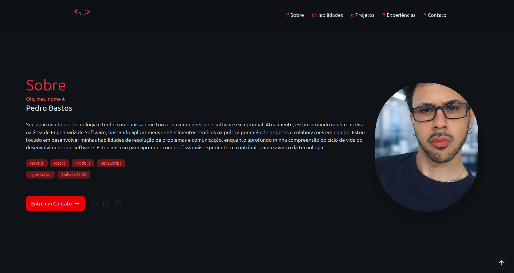

# 📌 Portfólio - Pedro H. Bastos


Meu portfólio pessoal desenvolvido para apresentar meus projetos, habilidades e experiência como desenvolvedor Frontend.

## 🔗 Acesse o site

👉 https://pedrobastos-portfolio.vercel.app/

## 📸 Preview



---

## 🚀 Sobre o projeto

Este projeto foi criado com o objetivo de centralizar meus principais trabalhos, apresentar meu perfil profissional e facilitar o contato para oportunidades na área de tecnologia.

O site é totalmente responsivo e focado em performance, organização de código e boa experiência do usuário.

---

## ⭐ Funcionalidades

- Apresentação pessoal
- Listagem de projetos com links
- Seção de habilidades técnicas
- Design responsivo (mobile, tablet e desktop)
- Links para contato (GitHub, LinkedIn)

---

## 🛠️ Tecnologias utilizadas

- Next.js
- React
- TypeScript
- Tailwind CSS
- Vercel (deploy)

---

## 📥 Como rodar o projeto localmente

```bash
# Clone o repositório
git clone https://github.com/pedrohbastos94/my-portfolio.git

# Entre na pasta
cd my-portfolio

# Instale as dependências
npm install

# Rode o projeto
npm run dev

# Acesse no navegador
http://localhost:3000
```
